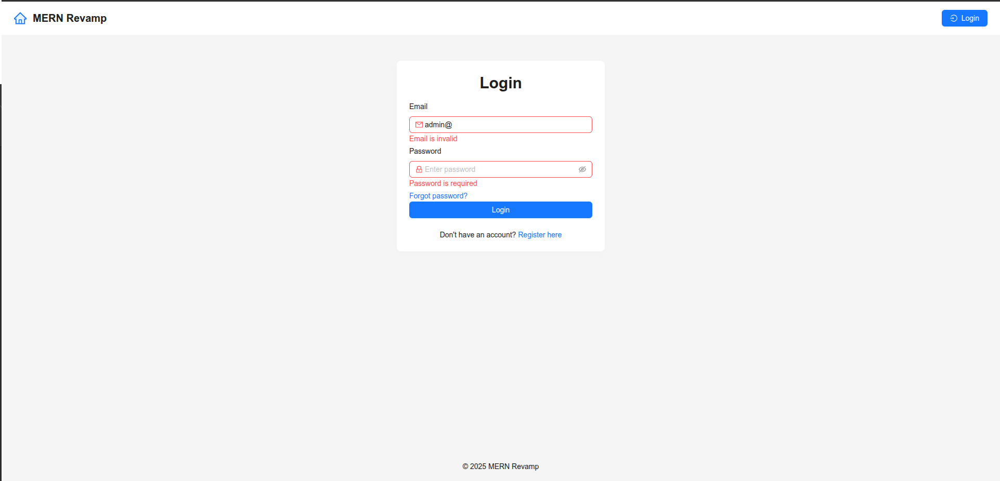

# MERN-Revamp Boilerplate

## 🚀 Overview

A modern, production-ready MERN (MongoDB, Express, React, Node.js) boilerplate featuring authentication, user management, protected/public routes, admin controls, and more.

## 📦 Tech Stack

- **Frontend:** React, Ant Design, Axios, React Router
- **Backend:** Node.js, Express, MongoDB, Mongoose
- **Auth:** JWT, HTTP-only cookies
- **Other:** Multer (file uploads), dotenv, logging

## 🛠️ Getting Started

### Prerequisites

- Node.js & npm
- MongoDB

### Installation

```bash

git clone https://github.com/yourusername/mern-revamp.git
cd mern-revamp
./start.sh

```

### Environment Variables

- Configure `.env` files in server and client folders.

## ▶️ Running the Application

- Install dependencies and build with start.sh for non-experts. (You can host the backend / frontend) each on it's dedicated machine or all in one project with start.sh file and of course you can check the package.json files included into the ./server and ./client folders

## ✨ Features

- User registration, login, email verification, password reset
- Profile view/edit with avatar and bio
- Users list with filtering and pagination
- User details, admin edit/delete
- Protected and public routes
- Logging and error handling

## 🔗 API Endpoints [You can check postman collection file here also](./Revamp.postman_collection.json)

| Method | Endpoint           | Description                  |
| :----- | :----------------- | :--------------------------- |
| POST   | `/api/users`       | Register user                |
| POST   | `/api/users/login` | Login                        |
| GET    | `/api/users/me`    | Get current user profile     |
| PATCH  | `/api/users/me`    | Update own profile           |
| GET    | `/api/users`       | Get all users (with filters) |
| GET    | `/api/users/:id`   | Get user by ID               |
| PATCH  | `/api/users/:id`   | Admin update user by ID      |
| DELETE | `/api/users/:id`   | Admin delete user by ID      |

## 🖼️ Screenshots





## 🧩 Customization

- Change theme, add new fields, extend user roles, etc.
- See code comments for extension points.

---

## 🐞 Troubleshooting

- Common errors and solutions
- How to reset database, clear cache, etc.

---

## 🙏 Credits

- Ant Design
- @faker-js/faker
- pravatar.cc

---

**You can copy, edit, and expand this template as needed!**

   

---
